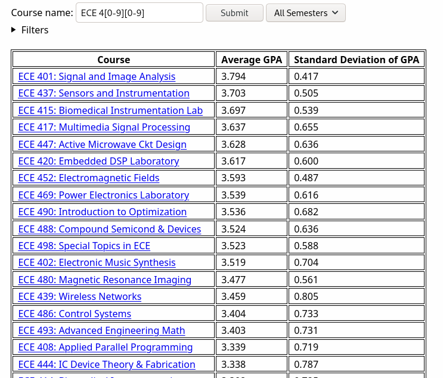
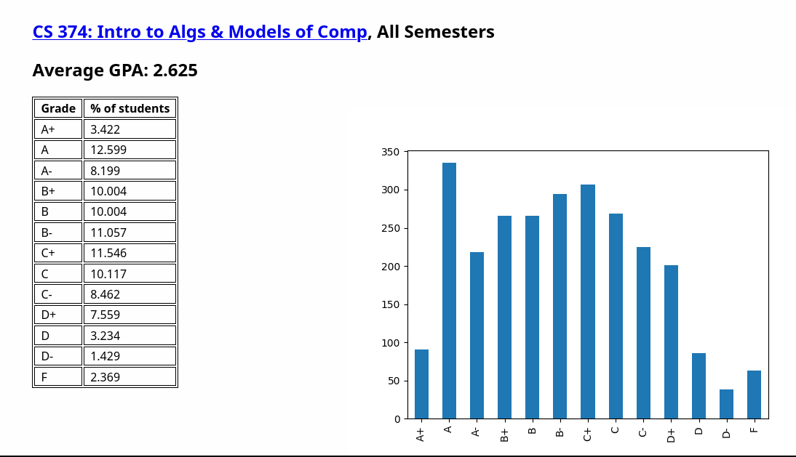

# GPA++: Powerful search engine for UIUC courses
## Features
* Regex Search
* Filter courses
* Sorted by GPA, highest first (thus can be used as an easy gen ed finder)
* Support for cross-listed courses
* Bar plot of the curve
* Per semester and per instructor GPA stats
* Lightweight and fast

## Instructions to self-host
* Clone this repo: `git clone https://github.com/chin123/gpa`
* Install [re2](https://github.com/google/re2/)
* Install other requirements: `cd gpa; pip install -r requirements.txt`
* Run the program: `python3 gpapp.py`
* Once a semester: run `process_data.py` with a newly updated `uiuc-gpa-dataset.csv` (gpa) and `gened-courses.csv` (geneds) from [Wade's datasets](https://github.com/wadefagen/datasets)
